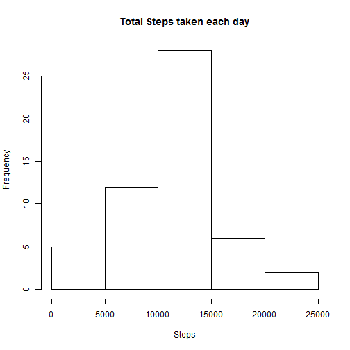
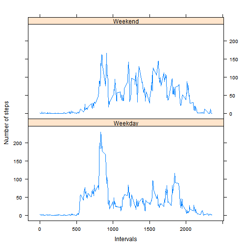
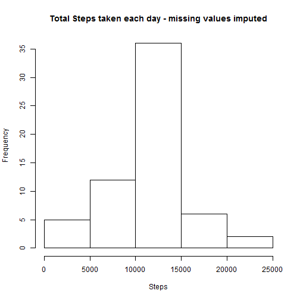
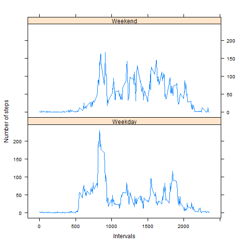

**Loading and preprocessing the data**


```r
#Include required packages
library(plyr)
library(lattice)
```

```
## Warning: package 'lattice' was built under R version 3.1.3
```

```r
options(scipen=1, digits=2)

#Read data
url<-"C:/Users/dsambhar/Jyoti/Coursera_ReproducibleResearch/PA1/activity.csv"
AMData<-read.csv(url,header=TRUE,sep=",")
```

**What is mean total number of steps taken per day?**

```r
#calculate total no of steps taken each day
AM<-aggregate(steps~date,AMData,sum)

#Mean and Median of steps taken each day
AM_Mean<-mean(AM$steps)
AM_Median<-median(AM$steps)

#Draw a histogram showing no of steps taken each day.
hist(AM$steps,main="Total Steps taken each day",xlab="Steps")
```

 

1) Mean of total number of steps taken per day is 10766.19

2) Median of total number of steps taken per day is 10765

**What is the average daily activity pattern?**


```r
#get the average no of steps taken each interval
AMDaily<-aggregate(steps~interval,AMData,mean)

#Plot a graph showing Avergae no of steps taken each 5 minute interval
plot(AMDaily$steps~AMDaily$interval,AMDaily,type="l",xlab="5 minute Interval", ylab="Average steps")

# find Maximum no of steps taken and point on the graph in red color
maxim<-which.max(AMDaily$steps)
points(AMDaily[maxim,1],AMDaily[maxim,2],col="red")
```

 

On average across all the days in the dataset, 5 minute Interval at 835 contains the maximum number of steps.

**Inputing missing values**

```r
#no of missing values in data
NAVAL<-length(which(is.na(AMData$steps)))

#Replica of original data
AM1Data <-AMData

#Imputing missing values with mean of steps taken during 5 minute interval.
AM1Data$steps<-replace(AM1Data$steps,is.na(AM1Data$steps),AMDaily$steps)

#get the average no of steps taken each interval after imputing missing values
AM1<-aggregate(steps~date,AM1Data,sum)
AM1_Mean<-mean(AM1$steps)
AM1_Median<-median(AM1$steps)

#Draw a histogram showing no of steps taken each day.
hist(AM1$steps,main="Total Steps taken each day - missing values imputed",xlab="Steps")
```

 

There are total of 2304 missing values in the dataset.

After filling in missing values in dataset with mean of number of steps taken during that particular 5 minute interval

1) Mean of total number of steps taken per day is 10766.19

2) Median of total number of steps taken per day is 10766.19

We can see new mean and median values doesn't differ much from previous values. There is not much change or impact of imputing missing data on the estimates of the total daily number of steps.

**Are there differences in activity patterns between weekdays and weekends?**


```r
#Classify date as weekday or weekend
AM1Data<-mutate(AM1Data, 
       weekday=as.factor(ifelse(weekdays(as.Date(date)) %in% c("Saturday","Sunday"), "Weekend", "Weekday")))

# Calculate average no of steps taken over 5 minute intervals during Weekday and Weekend and plot graph
AM1Daily<-aggregate(steps~interval+weekday,AM1Data,mean)
xyplot(steps~interval|weekday,data=AM1Daily, type="l",xlab="Intervals",ylab="Number of steps",layout=c(1,2))
```

 

Looking at above plot it is evident that no of steps taken over the weekend are more consistent than on weekday.
